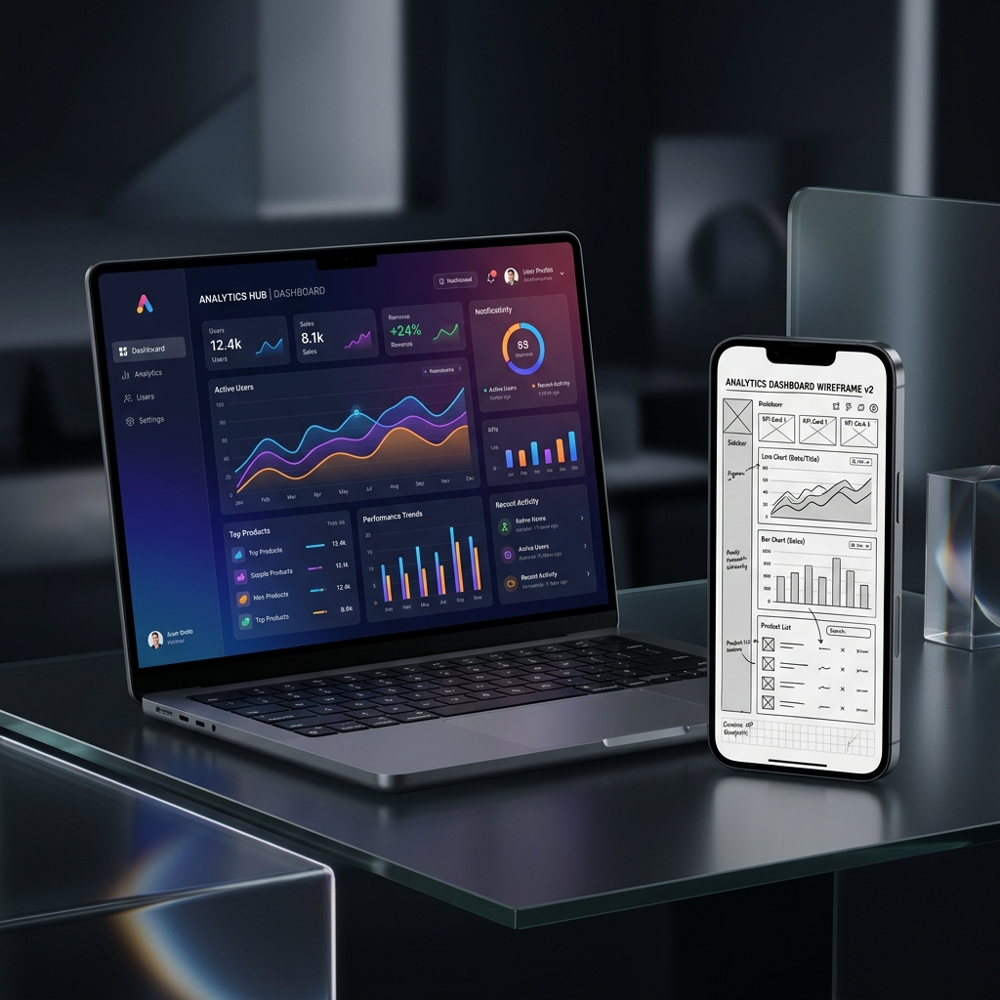

# Joseph Quisido - UI/UX Designer Portfolio

A modern, responsive portfolio website for a UI/UX designer showcasing projects, skills, and experience.

## �� Features

- **Fully Responsive Design** - Works seamlessly on desktop, tablet, and mobile devices
- **Modern Gradient UI** - Eye-catching purple and pink gradient design
- **Smooth Animations** - Engaging fade-in animations and transitions
- **Mobile Menu** - Hamburger menu for mobile navigation
- **Project Showcase** - Display your best work with project cards
- **Skills Section** - Highlight your design tools and expertise
- **Contact Form** - Easy way for potential clients to reach out
- **SEO Friendly** - Semantic HTML structure
- **Fast Loading** - Lightweight and optimized
- **Keyboard Shortcuts** - Quick navigation (Alt+H, Alt+A, Alt+P, Alt+S, Alt+C)

## 🛠 Tech Stack

- HTML5
- CSS3 (with CSS Grid & Flexbox)
- Vanilla JavaScript
- Responsive Design
- No dependencies!

## 📂 File Structure
